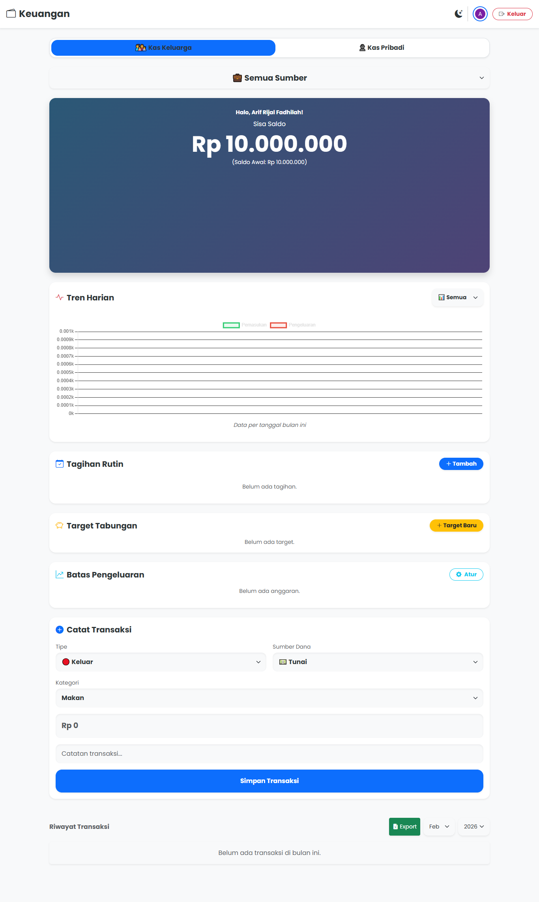
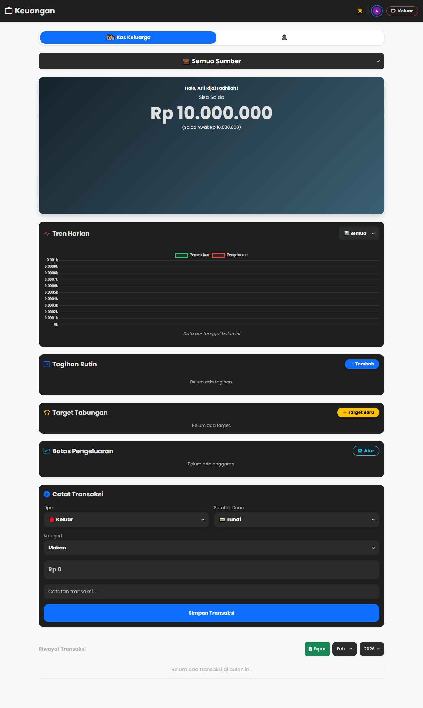

# 💸 Keuangan Keluarga App ✨

> Aplikasi PWA pintar dan estetik buat ngatur *cash flow* keluarga dan pribadi. *No more* drama uang hilang kemana! 🚀

---

## 📸 Sneak Peek

  
  

---

## 🌟 Key Features

Aplikasi ini dibikin buat bantu kamu *tracking* uang masuk dan keluar dengan gampang, plus fitur-fitur super asyik:

- 👨‍👩‍👧‍👦 **Split Mode (Keluarga vs Pribadi)**: Atur kas keluarga (bisa diakses admin & anggota) atau kas pribadimu sendiri. Aman dan terpisah!
- 🎨 **Aesthetic Dark Mode**: Transisi *smooth* ke mode gelap. *Save your battery & your eyes!* 🌙
- 📊 **Smart Dashboard**: Visualisasi data pengeluaran dan pemasukan harian pakai **Chart.js** (Doughnut & Line Chart).
- 🎯 **Savings Goal (Tabungan)**: Punya *wishlist* beli HP atau liburan? Bikin target tabungan dan pantau *progress*-nya.
- 📅 **Routine Bills (Tagihan Rutin)**: Catat langganan Netflix, Spotify, atau tagihan bulanan biar nggak lupa dan nggak kena denda.
- 📱 **PWA Ready**: Bisa di-install langsung ke *homescreen* HP-mu layaknya aplikasi bawaan tanpa harus masuk PlayStore.
- 📥 **Export to CSV**: Tinggal klik, langsung ke-download laporan bulanan dalam format Excel/CSV. 
- 🔒 **Secure Google Login**: Masuk gampang & aman pakai akun Google berkat Firebase Auth.

---

## 🛠️ Tech Stack

Dibuat dengan teknologi web modern:
- **Frontend**: HTML5, CSS3 (Custom Variables for Theming), Vanilla JavaScript.
- **UI Framework**: Bootstrap 5.3 + Bootstrap Icons.
- **Charts**: Chart.js.
- **Backend & Database**: Firebase (Auth, Firestore, Hosting).
- **Architecture**: Progressive Web App (PWA) dengan Service Worker.
