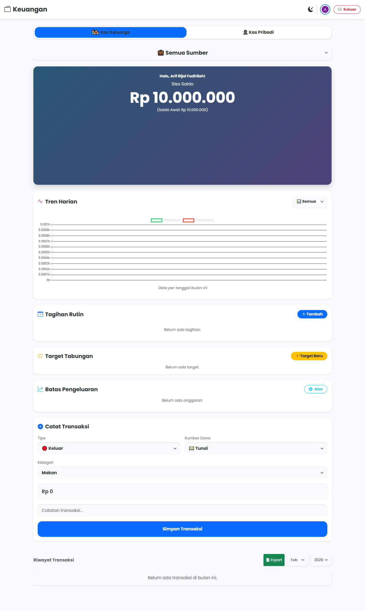
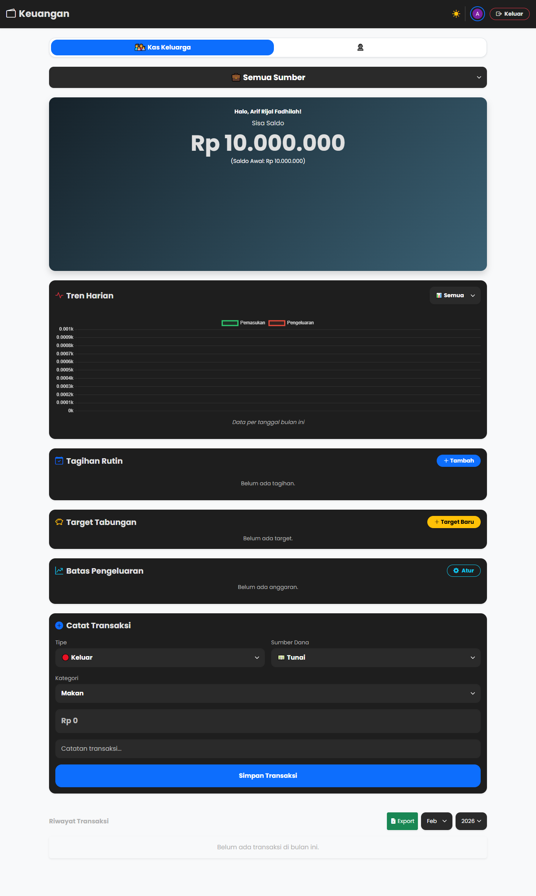

# 💸 Keuangan Keluarga App ✨

> Aplikasi PWA pintar untuk mengelola _cash flow_ keluarga dan pribadi. Kini lebih aman dengan sistem autentikasi mandiri dan pembatasan akses cerdas! 🚀

---

## 📸 Sneak Peek

  
  

---

## 🌟 Fitur Unggulan Terupdate

Aplikasi ini telah ditingkatkan dengan sistem keamanan berlapis untuk menjaga privasi data keuangan kamu:

- 🔐 **Multi-Auth System**: Masuk lebih fleksibel menggunakan akun **Email & Password** atau tetap menggunakan **Google Login**.
- 🛡️ **Smart Access Control**:
  - **Anggota Keluarga**: Mendapat akses penuh ke Kas Keluarga, Kas Pribadi, dan fitur transfer.
  - **Tamu/Anggota Baru**: Hanya dapat melihat dan mengelola Kas Pribadi mereka sendiri. Tab Kas Keluarga disembunyikan secara otomatis untuk menjaga privasi.
- 📧 **Security Verification**: Dilengkapi dengan **Verifikasi Email** saat pendaftaran dan fitur **Reset Password** untuk memulihkan akun yang lupa kata sandi.
- ⚡ **Real-time Validation**: Validasi format email secara langsung saat mengetik untuk pengalaman pengguna yang lebih _smooth_.
- 👨‍👩‍👧‍👦 **Admin Privileges**: Akun Admin memiliki wewenang khusus untuk mengatur saldo awal keluarga dan mengelola target tabungan bersama.
- 🎨 **Glassmorphism UI**: Tampilan layar login yang modern dengan efek blur transparan yang aesthetic.
- 📱 **PWA Ready**: Bisa di-install langsung ke _homescreen_ HP layaknya aplikasi native melalui browser.
- 📥 **Export to CSV**: Download laporan bulanan dalam format CSV yang rapi untuk keperluan audit mandiri.

---

## 🛠️ Tech Stack

Dibuat dengan teknologi web modern untuk performa maksimal:

- **Frontend**: HTML5, CSS3 (Custom Variables & Glassmorphism), Vanilla JavaScript.
- **UI Framework**: Bootstrap 5.3 + Bootstrap Icons.
- **Charts**: Chart.js untuk visualisasi tren harian dan kategori.
- **Backend & Database**: Firebase (Authentication, Firestore NoSQL, Hosting).
- **Security**: Implementasi _API Key restrictions_ dan _Client-side routing protection_.

---

### Cara Install di HP (PWA)

1. Buka link aplikasi di browser (Chrome/Edge).
2. Klik ikon **Tiga Titik** di pojok kanan atas.
3. Pilih **"Instal Aplikasi"** atau **"Tambahkan ke Layar Utama"**.
4. Aplikasi siap digunakan langsung dari menu HP kamu!
